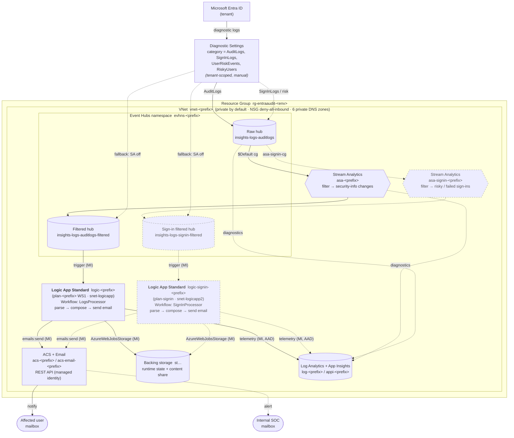
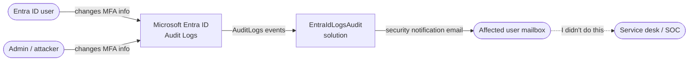
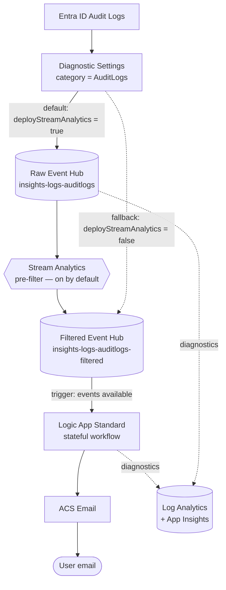
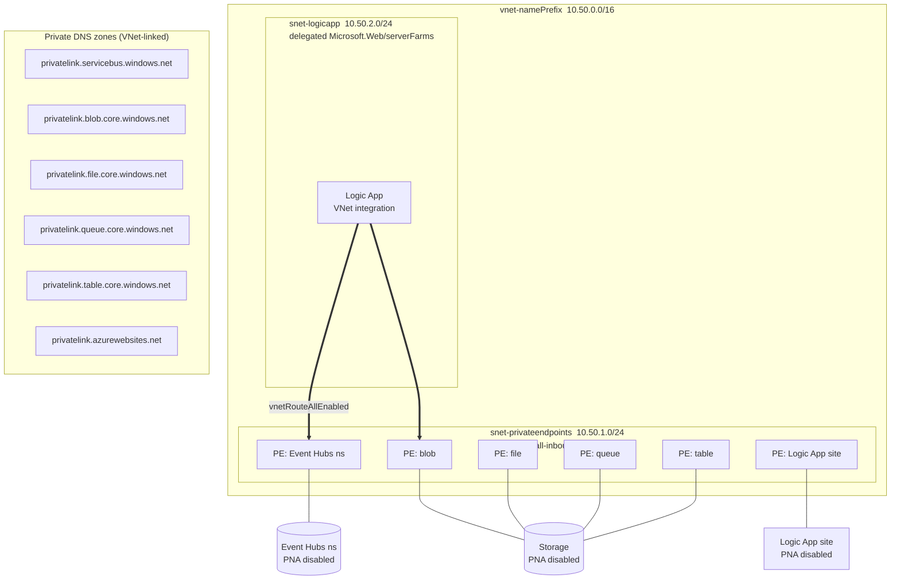
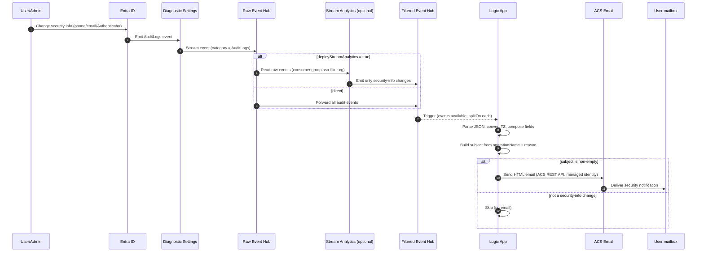
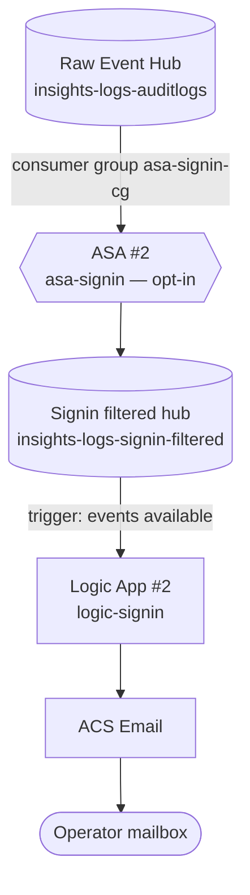

# EntraIdLogsAudit — Architecture Reference

## 1. Purpose

`EntraIdLogsAudit` is an **Azure Logic Apps Standard** solution that watches
Microsoft **Entra ID Audit Logs** for **security-information (MFA) changes** —
registering, updating, or deleting a phone number, email, or Microsoft
Authenticator registration — and automatically **emails the affected user** a
security notification via **Azure Communication Services (ACS) Email**.

The notification tells the user that their security info changed and to contact
the service desk (`Ext. NNNN` / `#IncidentGroup@example.com`) if they did not make
the change, providing fast detection of potential account-takeover activity.

## 2. Components

| Component | Resource (Bicep name pattern) | Role |
|-----------|------------------------------|------|
| Entra ID | tenant-level (not in RG) | Source of Audit Logs |
| Diagnostic Settings | tenant-level (manual/post-deploy) | Routes `AuditLogs` category to the **raw** Event Hub |
| Raw Event Hub | `evhns-${namePrefix}` / `insights-logs-auditlogs` | Landing buffer for all audit events |
| Stream Analytics *(on by default)* | `asa-${namePrefix}` | Pre-filters events to security-info changes (raw → filtered) |
| Filtered Event Hub | `evhns-${namePrefix}` / `insights-logs-auditlogs-filtered` | Trigger source for the Logic App |
| Logic App Standard | `logic-${namePrefix}` (plan `plan-${namePrefix}`) | Parses events, composes & sends email |
| Backing storage | `st…` (generated) | Logic App runtime state / content share |
| ACS + Email | `acs-${namePrefix}`, `acs-email-${namePrefix}` | Sends the notification email |
| Monitoring | `log-${namePrefix}`, `appi-${namePrefix}` | Log Analytics workspace + Application Insights |
| Network | `vnet-${namePrefix}`, 2 subnets, NSGs, 6 private DNS zones | Private-by-default connectivity |
| **Sign-in/risk pipeline** *(optional, off by default)* | `asa-signin-${namePrefix}`, `logic-signin-${namePrefix}`, `insights-logs-signin-filtered`, `snet-logicapp2` | Parallel **opt-in** probe for sign-in/risk alerts to an internal mailbox — see [§10](#10-optional-sign-inrisk-alerting-pipeline-off-by-default) |

> Filtering can happen **two ways**. By **default** (`deployStreamAnalytics =
> true`) an Azure Stream Analytics job pre-filters raw → filtered so only
> security-info events reach the Logic App — minimizing the filtered-hub volume
> and the Logic App's load. As a fallback (`deployStreamAnalytics = false`) the
> Logic App instead reads **all** audit events on the filtered hub and discards
> non-security-info events internally (it only sends mail when it builds a
> non-empty subject), at the cost of higher Logic App load.

> **Source filtering is category-level only.** Entra Diagnostic Settings can
> select the `AuditLogs` category but cannot filter by operation. Per-operation
> filtering happens downstream (Stream Analytics and/or the Logic App).

## 2a. Full system diagram (all deployed components)

This is the complete picture of everything stood up by the Bicep — the
**core MFA-change pipeline** (always deployed) plus the **optional sign-in/risk
probe** (dashed, `deploySignInPipeline = true`), the surrounding **private
network**, **shared identities/RBAC**, and **observability**. Use this as the
single reference when explaining the architecture end-to-end.

> **Identity & RBAC (all key-less).** Each Logic App authenticates with its
> **system-assigned managed identity** for Event Hubs (**Data Receiver**), ACS
> (**Contributor**, via REST), and App Insights (**Monitoring Metrics
> Publisher**), plus a companion **user-assigned identity** for
> `AzureWebJobsStorage` (the workflow `Data.Edge` runtime requires UAMI). Stream
> Analytics jobs use their own managed identities (Data Receiver on raw, Data
> Sender on filtered). See [§7](#7-identity--access-rbac) for the full role list. The
> only shared keys are the WS content share and the Azure Monitor → Event Hub SAS
> delivery rule.

## 3. Context diagram

## 4. Data flow

### Workflow internals (Logic App)

1. **Trigger** — `When_events_are_available_in_Event_hub` on
   `insights-logs-auditlogs-filtered`, consumer group `$Default`,
   `splitOn` each event in the batch.
2. **Parse_JSON** — parses the Entra audit schema (`eventTime`, `operationName`,
   `category`, `correlationId`, `activityResult`, `activityResultReason`,
   `identity`, and `rawEvent.properties.{initiatedBy, targetResources}`).
3. **Convert_time_zone** — UTC → Eastern Standard Time for display.
4. **Compose** — sender (`@{appsetting('acs_sender')}`), recipients (TO the
   target user UPN; BCC the optional SOC mailbox `@{appsetting('alert_recipient')}`
   when set, otherwise user-only), activity, details, time, initiated-by.
5. **Subject builder** — nested `if()` on `operationName` +
   `activityResultReason` chooses the subject / opening message / action verb
   for registered/updated/deleted security info (phone / email / Authenticator).
6. **Condition_send_email** — if the computed subject is non-empty, send the
   HTML email by calling the **ACS Email REST API** directly over HTTP with the
   managed identity (`@{appsetting('acs_endpoint')}/emails:send`, api-version
   `2023-03-31`).

## 5. Network topology (private by default)

**Lockdown characteristics**

- Storage and the Logic App site have `publicNetworkAccess = Disabled`. The
  Event Hubs namespace is also `Disabled` **except** in the default ASA
  `firewallException` mode, where it is `Enabled` with a **deny-by-default**
  network rule set that bypasses only the ASA trusted Microsoft service (and a
  VNet rule on the Logic App subnet) — there is no anonymous public path.
- All PaaS traffic flows over **Private Endpoints** in `snet-privateendpoints`.
- The Logic App is **VNet-integrated** into `snet-logicapp` with
  `vnetRouteAllEnabled`, so all outbound traffic (to Event Hubs, storage, ACS)
  uses the VNet and private DNS.
- NSGs **deny all inbound** by default (priority 4096) and only allow
  intra-VNet traffic (priority 100).
- Six private DNS zones are linked to the VNet so private endpoint FQDNs resolve
  to private IPs.
- `httpsOnly`, `ftpsState = Disabled`, `minTlsVersion = 1.2` on the site.

## 6. Sequence — from MFA change to email

## 7. Identity & access (RBAC)

- The Logic App runs under a **system-assigned managed identity**, used for
  **all** connectivity — no connection strings or access keys are used.
- **Event Hubs** — granted **Azure Event Hubs Data Receiver**
  (`f526a384-b230-433a-b45c-95f59c4a2dec`) on the namespace to consume the
  filtered hub. The trigger uses the namespace FQDN + managed identity.
- **Storage** (`AzureWebJobsStorage`) — granted **Storage Blob Data Owner**,
  **Storage Queue Data Contributor**, **Storage Table Data Contributor**,
  **Storage Account Contributor**, and **Storage File Data SMB Share
  Contributor**, so the runtime uses identity-based `AzureWebJobsStorage__accountName`
  instead of a shared key.
  - The classic WebJobs host authenticates with the **system-assigned** identity
    (`AzureWebJobsStorage__credential = managedidentity`).
  - The newer workflow data engine (`Microsoft.Azure.Workflows.Data.Edge`) only
    honors a **user-assigned** identity for `AzureWebJobsStorage` — it ignores the
    system-assigned one and requires `AzureWebJobsStorage__credentialType =
    managedIdentity` (camelCase, case-sensitive) plus
    `AzureWebJobsStorage__managedIdentityResourceId`. A dedicated user-assigned
    identity (`id-<prefix>`) is therefore created and granted the **same** five
    storage roles. Without it the host runtime stays in `Error` state with
    `The authentication credential type for the storage account isn't valid`,
    and every workflow trigger returns `ServiceUnavailable from host runtime`.
- **ACS Email** — granted **Contributor** scoped to the Communication Services
  resource; the workflow calls the **ACS Email REST API** over HTTP with the
  managed identity (`audience https://communication.azure.com`). This replaces
  the former key-based `acsemail` managed connection.
- **Application Insights** — granted **Monitoring Metrics Publisher** on the
  component, which has `DisableLocalAuth = true`. Telemetry is ingested via the
  managed identity (`APPLICATIONINSIGHTS_AUTHENTICATION_STRING = Authorization=AAD`);
  the instrumentation key in the connection string is inert.
- When deployed, the **Stream Analytics** job uses its own managed identity with
  Event Hubs Data Receiver (raw) + Data Sender (filtered).

## 8. Known constraints

- **Entra Diagnostic Settings are tenant-scoped** and configured manually /
  post-deploy (they are not a resource-group resource in this template).
- **Two shared keys remain — both forced by platform limitations, not our design.**
  Both are covered by the scoped policy exemption
  `exempt-entraaudit-test-shared-key` (a **Waiver** against the org governance
  assignment `MCAPSGovDeployPolicies`, which carries `modify`-effect policies that
  otherwise force `disableLocalAuth = true` on storage **and** Event Hubs and
  re-apply on every write).

  **(a) Logic Apps Standard content share.**
  Logic Apps Standard on a **Workflow Standard (WS) plan** requires
  `WEBSITE_CONTENTAZUREFILECONNECTIONSTRING`, an Azure Files **shared-key**
  connection string, to mount its workflow content. The identity-based form
  (`__accountName`/`__credential`) is **only supported on Flex Consumption**, not
  on WS plans. As a result:
  - the storage account keeps `allowSharedKeyAccess = true`, covered by the
    exemption reference `StorageAccountDisableLocalAuth`;
  - the key is **never stored in source** — it is resolved at deploy time via
    `storage.listKeys()` in [`logicapp.bicep`](../infra/modules/logicapp.bicep);
  - the storage account stays private (`publicNetworkAccess = Disabled`); the
    content share is reached over its private endpoint.

  **(b) Event Hub SAS rule for tenant-log delivery.**
  The Entra (tenant) Diagnostic Setting delivers Audit/Sign-in logs to the raw
  Event Hub `insights-logs-auditlogs`. **Azure Monitor diagnostic settings can
  authenticate to an Event Hubs destination only via a SAS authorization rule**
  (`RootManageSharedAccessKey`) — there is **no managed-identity option** for the
  diagnostic-settings→Event Hub path. The namespace must therefore keep
  `disableLocalAuth = false`, covered by the exemption reference
  `eventhubdisablelocalauth`. **Failure mode:** if the governance policy flips
  `disableLocalAuth` back to `true` (i.e. the exemption is missing or removed),
  Azure Monitor's SAS delivery is silently rejected — the raw hub receives **0
  events**, Stream Analytics has no input, the filtered hub stays empty, and the
  Logic App never triggers. This was the observed “no events in either hub”
  outage; the fix is the `eventhubdisablelocalauth` waiver above plus re-asserting
  `disableLocalAuth = false` on the namespace.

  > **⚠️ Customer review pending — shared keys may not be acceptable.** The
  > customer is confirming **how tenant-log export to Event Hubs was configured
  > before this engagement** (whether they already accept the Azure Monitor SAS
  > delivery model, or use a different export path). Until that is settled, treat
  > both keys as provisional:
  >
  > - **Content-share key (a)** can be eliminated by moving the Logic App off the
  >   WS plan to **Flex Consumption** (or another fully identity-capable host),
  >   which supports identity-based content storage — letting
  >   `allowSharedKeyAccess` be set to `false`, dropping
  >   `WEBSITE_CONTENTAZUREFILECONNECTIONSTRING`, and retiring the
  >   `StorageAccountDisableLocalAuth` exemption reference. This is a
  >   hosting-model migration (plan + app settings + validation), not a one-line
  >   toggle.
  > - **Event Hub SAS key (b)** has **no first-party key-less alternative today**
  >   for the diagnostic-settings→Event Hub destination. Removing it would require
  >   a different export architecture (e.g. route tenant logs to Log Analytics and
  >   consume from there, or have a managed-identity consumer pull from a hub fed
  >   by a different mechanism). Tracked as an open item pending the customer's
  >   confirmation of their prior setup.
- **Stream Analytics + private Event Hub**: a standard (non-cluster) ASA job
  cannot reach an Event Hub with `publicNetworkAccess = Disabled` over private
  link alone. Two connectivity modes are offered via `asaConnectivityMode`:
  - **`firewallException`** *(default)* — ASA is an Event Hubs **trusted
    Microsoft service** and reaches the namespace via its managed identity while
    the namespace stays **deny-by-default** (PNA Enabled + `defaultAction = Deny`
    + `trustedServiceAccessEnabled` + a VNet rule). Low cost (~$80/mo).
  - **`dedicatedCluster`** *(opt-in, fully private)* — an ASA **dedicated
    cluster + managed private endpoint** lets ASA reach a namespace that keeps
    `publicNetworkAccess = Disabled`. Preserves a no-public-endpoint posture but
    costs **~$2,890/mo fixed** (36-SU cluster minimum). The cluster resources are
    documented but not yet provisioned in the Bicep. See the deployment guide.

## 9. Cloud portability (Azure Government / sovereign clouds)

> **Current target: Azure commercial (public) cloud only.** Azure Government is
> *not* in scope today. This section records what would need to change so the
> solution can be safely reused in Azure Government (or another sovereign cloud)
> later, and is intended as a checklist for that future effort.

**Good news — no hard service blockers.** Every component is available in Azure
Government: Event Hubs, Storage, Logic Apps Standard, Stream Analytics (incl. the
trusted-service firewall bypass), Log Analytics / App Insights, and — as of GA —
**Azure Communication Services Email** (FedRAMP High / GCC-High). So the design
itself ports; the work is about **endpoints and a few hardcoded values**.

### What is already cloud-agnostic (no change needed)

- **Storage endpoints / DNS** — `logicapp.bicep` builds the storage connection
  string with `environment().suffixes.storage`, and `network.bicep` derives the
  blob/file/queue/table private DNS zones the same way. In Gov these resolve to
  `core.usgovcloudapi.net` automatically.
- **Entra Diagnostic Settings path** — `/providers/Microsoft.aadiam` is an ARM
  provider path, identical across clouds.
- **Resource types & API versions** — all `Microsoft.*` types used here exist in
  Gov.
- **Stream Analytics → Event Hubs** — the ASA input/output reference the bare
  namespace *name*, not an FQDN, so the platform resolves the correct
  per-cloud endpoint. ASA managed identity + trusted-service bypass work in Gov.

### What must change for Gov (the real porting checklist)

| # | Item | Where | Why / fix |
|---|------|-------|-----------|
| 1 | **Event Hubs private DNS zone** is hardcoded `privatelink.servicebus.windows.net` | [`network.bicep`](../infra/modules/network.bicep) | Gov uses `privatelink.servicebus.usgovcloudapi.net`. Parametrize or map per cloud — otherwise the Event Hubs private endpoint won't resolve and the Logic App can't reach the hub. |
| 2 | **Logic App (App Service) private DNS zone** is hardcoded `privatelink.azurewebsites.net` | [`network.bicep`](../infra/modules/network.bicep) | Gov uses `privatelink.azurewebsites.us`. Same fix as #1. |
| 3 | **ACS sender address** is driven by the `acs_sender` app setting (Bicep auto-fills it from the ACS managed-domain output; the workflow reads `@{appsetting('acs_sender')}`) | [`logicapp.bicep`](../infra/modules/logicapp.bicep) (`acsSenderAddress` param), [`workflow.json`](../LogsProcessor/LogsProcessor/workflow.json) (`Set_SenderAddress`) | Azure-managed ACS domains in Gov use a different suffix (not `azurecomm.net`). Because the sender is an app setting, no workflow code change is needed — just set `acs_sender` (or the `acsSenderAddress` param) to a sender from a domain verified in the target environment. Customers should override it with their own verified-domain sender. |
| 4 | **ACS Email REST API call** (`@{appsetting('acs_endpoint')}/emails:send`, managed-identity auth) | [`workflow.json`](../LogsProcessor/LogsProcessor/workflow.json) (`Send_email` HTTP action) | The ACS *service* is GA in Gov, but the **ACS data-plane endpoint suffix differs per cloud** (the `acs_endpoint` app setting is already per-deploy, so this is covered). The workflow does **not** use the Logic Apps `acsemail` managed connector or ACS **SMTP** (neither of which is needed/supported here) — it calls the REST API directly, so it is unaffected by connector-catalog differences. |
| 5 | **CLI cloud + portal** | deployment steps | Run `az cloud set --name AzureUSGovernment` before `az login`; perform portal steps (including the tenant Entra Diagnostic Settings) in `portal.azure.us`, in the Gov tenant. |

### Recommended approach if Gov ever becomes in scope

Keep a **single template** and make the two hardcoded private DNS zones (#1, #2)
cloud-portable — either by deriving them from a cloud-aware mapping or exposing
them as parameters that default to the commercial values — then add a
`main.gov.bicepparam` overriding the Gov zone names and region. Items #3–#5 are
per-deployment configuration handled in the deployment guide. This avoids
cloud-specific forks of the IaC.

> Until Gov is actually targeted, **no code changes are made** — this section
> exists so the implications are understood and the change is small and known
> when/if the time comes.

## 10. Optional sign-in/risk alerting pipeline *(off by default)*

> **Status: opt-in internal security probe — NOT part of the customer
> deliverable.** Controlled by `deploySignInPipeline` (**default `false`**). When
> off, **nothing** in this section is provisioned and the primary MFA-change
> pipeline (§1–9) is the entire solution. It is enabled only in the internal
> probe environments (`main.dev.bicepparam` / `main.test.bicepparam`) to validate
> the end-to-end workflow and to collect ongoing sign-in/risk telemetry for the
> operator's own mailbox.

### 10.1 Why it exists

The Entra tenant Diagnostic Setting already streams **sign-in** and **risk**
categories (`SignInLogs`, `NonInteractiveUserSignInLogs`, `UserRiskEvents`,
`RiskyUsers`, …) into the **same raw Event Hub** as the audit logs. That data is
therefore *already present* — this pipeline simply taps it through a **new
consumer group** and alerts on it, without touching the customer's MFA-change
pipeline.

### 10.2 Hard isolation from the customer pipeline

Everything is **duplicated, not shared** (except the raw hub, which is read-only
and multi-consumer by design):

| Concern | Customer pipeline (§1–9) | Sign-in/risk pipeline (§10) |
|---------|------------------------|----------------------------|
| Raw hub consumer group | `asa-filter-cg` | **`asa-signin-cg`** (separate offset/checkpoint) |
| Stream Analytics job | `asa-${prefix}` | **`asa-signin-${prefix}`** |
| Filtered hub | `insights-logs-auditlogs-filtered` | **`insights-logs-signin-filtered`** |
| Logic App + plan | `logic-${prefix}` / `plan-${prefix}` | **`logic-signin-${prefix}` / `plan-signin-${prefix}`** |
| Storage identity | `id-${prefix}` | **`id-signin-${prefix}`** |
| VNet-integration subnet | `snet-logicapp` | **`snet-logicapp2`** (`10.x.3.0/24`) |
| Content share | `logic-${prefix}` | **`logic-signin-${prefix}`** |
| Email recipient | **TO** the affected end user (target UPN); **BCC** the optional SOC mailbox (`socRecipientAddress`) when set | **TO** the affected user when the sign-in name is a valid email (else the operator mailbox); **BCC** the operator mailbox (`alertRecipientAddress`) |

Because Event Hubs is append-only and each consumer group tracks its own offset,
the second ASA job reading the raw stream has **no effect** on the customer job's
throughput or checkpoints. The only shared resources are the raw hub, the
storage account (isolated by a separate content share + identity), the ACS
resource, and App Insights.

### 10.3 Data flow

### 10.4 What it filters

The ASA #2 query (`streamanalytics-signin.bicep`) emits an event when:

- **Risky sign-ins** — `SignInLogs` with `riskLevelDuringSignIn IN ('medium','high')`
  or `riskState = 'atRisk'`;
- **Failed sign-ins** — `SignInLogs` with a non-zero `status.errorCode`, excluding
  a curated list of **benign interactive interrupt codes** (MFA/CA prompts,
  consent, keep-me-signed-in, etc.) so the alert stream is not flooded;
- **Risk detections** — any `UserRiskEvents` record;
- **Risky users** — `RiskyUsers` with `riskState = 'atRisk'`.

The Logic App composes a single internal-facing security alert email per event
(event type, user, risk summary, IP/location/app, time, correlation id) and sends
it via the same managed-identity ACS REST path as the customer workflow.

### 10.5 Cost

~**$255/mo** when enabled (second Workflow Standard plan ~$175 + second standard
ASA job ~$80). The Event Hubs namespace stays at 1 TU; a second full-stream
reader doubles raw-hub *read* egress, which is comfortably within 1 TU for the
test volume but may warrant +1 TU at production sign-in volumes.

